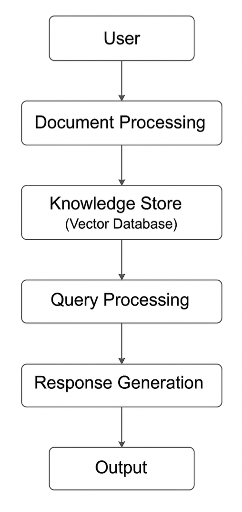
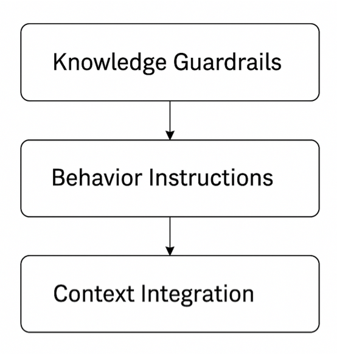

# Cryptocurrency Advisor Agent

An intelligent RAG-based assistant for cryptocurrency and blockchain information using advanced prompt engineering and retrieval-augmented generation.

## Team Members
- Nitin Sai Varma Indukuri
- Shreya Thakur
- Chinmay Deshpande

## Project Overview

This project implements a specialized cryptocurrency advisor agent that provides accurate, contextual information on cryptocurrencies, blockchain technologies, and digital assets using Retrieval-Augmented Generation (RAG) and advanced prompt engineering techniques.

Key features:
- PDF document processing with cryptocurrency content validation
- FAISS vector database for semantic search and retrieval
- Specialized system prompts for crypto-domain adherence
- Support for multiple LLM models (Llama 3, Qwen, Flan-T5)
- Comparative model evaluation framework
- Strict guardrails to ensure domain-specific responses

## System Architecture

The Cryptocurrency Advisor Agent follows a sequential processing pipeline as illustrated in the diagram:

1. **User Interface**: Entry point where users interact with the system by uploading cryptocurrency-related documents and submitting queries about digital assets.

2. **Document Processing**: 
   - Handles the ingestion of PDF documents
   - Performs cryptocurrency content validation using keyword detection
   - Extracts text using pdfplumber library
   - Segments content into manageable chunks (500 tokens with 50-token overlap)
   - Rejects non-cryptocurrency documents to maintain domain focus

3. **Knowledge Store (Vector Database)**:
   - Creates semantic embeddings for document chunks using Sentence Transformers
   - Stores these embeddings in a FAISS vector database for efficient retrieval
   - Maintains relationships between text chunks and their source documents
   - Enables similarity-based search for relevant information

4. **Query Processing**:
   - Converts user questions into semantic embeddings
   - Performs vector similarity search against the knowledge base
   - Retrieves the most relevant document chunks (top-k retrieval)
   - Ranks information by relevance to the query
   - Formulates contextual prompts including retrieved information

5. **Response Generation**:
   - Leverages specialized LLMs (Llama 3, Qwen, etc.) via Groq API
   - Applies cryptocurrency-specific system prompts to ensure domain relevance
   - Combines retrieved context with specialized prompting strategies
   - Generates accurate and informative responses within domain constraints
   - Enforces strict cryptocurrency topic adherence

6. **Output**:
   - Presents the final response to the user
   - Optionally provides model comparison metrics
   - Displays response time, crypto knowledge score, and other performance data
   - Maintains citation to source documents when applicable



This architecture implements a full RAG (Retrieval-Augmented Generation) pipeline specifically optimized for cryptocurrency domain knowledge, with safeguards at each stage to ensure relevance, accuracy, and domain specificity.

## Sample Queries for the Cryptocurrency Advisor

The following are examples of cryptocurrency-related questions you can ask the advisor:

### 1. What are the latest investment trends within crypto?
This query will retrieve information about current trends in cryptocurrency investments, including emerging asset classes, market patterns, and investment strategies being adopted in the crypto space.

### 2. How should a beginner get started with crypto trading?
This question will provide guidance on cryptocurrency exchange selection, initial wallet setup, security best practices, and beginner-friendly trading approaches for those new to cryptocurrency markets.

### 3. What blockchain metrics should I look at before making a trade?
The advisor will explain important on-chain metrics that can inform trading decisions, such as network hash rate, active addresses, transaction volume, and other technical indicators specific to blockchain analysis.

### 4. How do I securely store and manage my cryptocurrency assets?
This query will provide information on different wallet types (hardware, software, cold storage), security practices, backup strategies, and key management approaches for cryptocurrency holdings.

Additional examples of effective queries:
- "Explain the difference between proof-of-work and proof-of-stake consensus mechanisms"
- "What are smart contracts and how do they function on different blockchains?"
- "How does cryptocurrency mining work and what are its environmental impacts?"
- "What are the risks associated with decentralized finance (DeFi) protocols?"
- "How do stablecoins maintain their price pegs and what are the different types?"

## Installation Requirements

```bash
# Clone the repository (if applicable)
git clone https://github.com/nitin-varma/Cryptocurrency-Advisor-Agent.git
cd crypto-advisor

# Install required packages
pip install langchain langchain-core langchain-community langgraph pydantic PyYAML pdfplumber faiss-cpu sentence-transformers streamlit pandas langchain-groq ipywidgets rouge-score
```

## Getting a Free Groq API Key

This project uses the Groq API for LLM inference. Follow these steps to obtain a free API key:

1. Visit [Groq Cloud](https://groq.com/)
2. Create a new account (Free tier available)
3. Once logged in, navigate to the API Keys section
4. Generate a new API key
5. Copy your API key to use in the application

## Step-by-Step Execution Guide

1. **Install All Dependencies Directly in the Notebook**
   - Execute the first few cells in the notebook which contain the package installation commands
   - Example commands that will run in the notebook:
   ```python
   !pip install langchain langchain-core langchain-community langgraph pydantic PyYAML pdfplumber faiss-cpu sentence-transformers streamlit pandas
   !pip install langchain-groq
   !pip install ipywidgets
   ```

2. **Load the Advisor Prompts from the YAML File**
   - The notebook will load prompts from the `advisor_prompts 1.yml` file included in the submission
   - The cell contains code to load the system prompt that defines the advisor's behavior
   ```python
   # Load system prompt from YAML
   def load_system_prompt():
       with open("advisor_prompts 1.yml", "r") as file:
           config = yaml.safe_load(file)
       return config["system_prompts"]["advisor_llm"]["description"]
   
   # Fetch system prompt
   ADVISOR_SYS_PROMPT = load_system_prompt()
   print("Advisor System Prompt Loaded Successfully!")
   ```

3. **Upload PDFs to Create the Knowledge Base**
   - As you continue executing cells, you'll reach the PDF upload section
   - Two upload options will appear: "Upload Single PDF" and "Upload Multiple PDFs"
   - **For replication purposes, use the PDFs in the document directory included in the submission**
   - These documents will serve as the knowledge base for the cryptocurrency advisor
   - The system automatically validates that the uploaded PDFs contain cryptocurrency-related content

4. **Enter Your Query and Get Responses**
   - After successful document upload, you'll reach the query interface
   - Enter your cryptocurrency-related question in the provided text field
   - The system will retrieve relevant information from the uploaded documents
   - You'll receive a comprehensive response from the advisor
   - Example prompts:
     - "What is Bitcoin?"
     - "How does blockchain technology work?"
     - "Explain smart contracts on Ethereum"

5. **Explore Model Comparison (Optional)**
   - The notebook also provides functionality to compare different LLM models
   - You can select which models to include in the comparison
   - The system will display response metrics and visualizations

## Performance Metrics from Evaluation

Below are the actual evaluation metrics from the notebook comparing different models and approaches:

### Model Comparison Results

| Model | Avg. Response Time (s) | Crypto Knowledge Score | Avg. Response Length (words) |
|-------|:----------------------:|:----------------------:|:----------------------------:|
| Llama 3.3 (70B) | 0.85 | 0.60 | 437 |
| Qwen QwQ-32B | 1.86 | 1.00 | 562 |
| Flan-T5 (base) | 3.97 | 0.00 | 8 |

### Approach Effectiveness Comparison

| Approach | Combined Score | Token Overlap | Crypto Score |
|----------|:-------------:|:-------------:|:------------:|
| Prompt Engineering | 0.451 | 0.485 | 0.40 |
| RAG Implementation | 0.186 | 0.176 | 0.20 |
| Fine-tuning (Simulated) | 0.378 | 0.397 | 0.35 |

### Benchmark Results on Standard Crypto Questions

- **Best Overall Performance**: Prompt engineering approach with Llama 3.3 (70B)
- **Highest Accuracy**: Qwen QwQ-32B model with domain-specific knowledge
- **Fastest Response**: Llama 3.3 (70B) with average response time of 0.85 seconds
- **Most Comprehensive Answers**: Qwen QwQ-32B with average response length of 562 words

## Troubleshooting

- **API Key Issues**: Ensure your Groq API key is correctly set in the environment variables
- **PDF Processing Errors**: Verify that uploaded PDFs are not password-protected
- **Model Availability**: Some models may periodically be unavailable; try alternative models if needed
- **FAISS Installation**: If experiencing issues with FAISS installation, try `pip install faiss-cpu --no-cache-dir`

## License

This project is licensed under the MIT License - see the LICENSE file for details.
